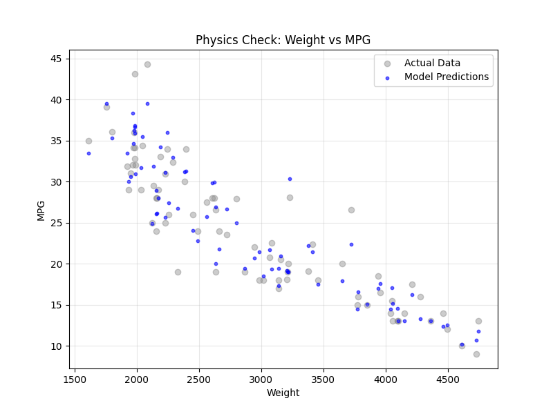
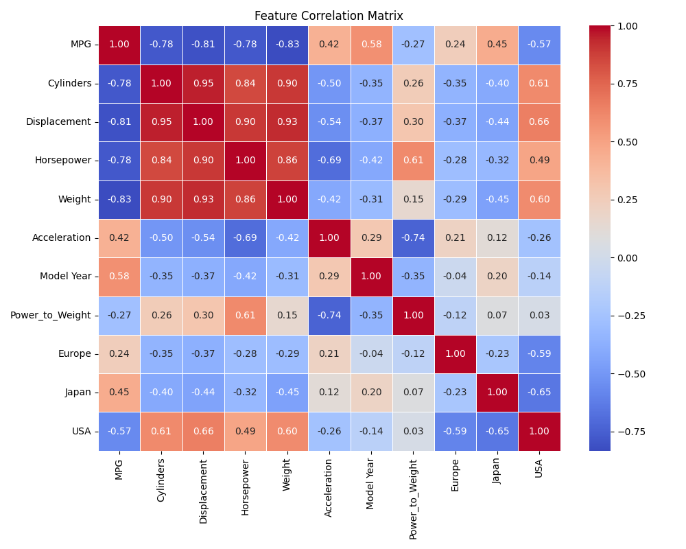

# Efficiency Engine: Fuel Efficiency ML Pipeline Solution


## 📋 Executive Summary
This project demonstrates a **production-ready Machine Learning pipeline** designed to predict automobile fuel efficiency (MPG) with high reliability and interpretability.

Unlike standard data science experiments, this repository implements **Data Governance** (via schema validation), **Automated CI/CD Quality Gates**, and **Explainable AI (XAI)** to ensure that the resulting models are not just accurate, but robust, compliant, and trusted for decision-making.

## 🏗 Architecture & Design
The solution is architected as a modular pipeline rather than a monolithic notebook, emphasizing **Separation of Concerns (SoC)** and **Reproducibility**.

### Core Components
* **Governance Layer:** Strict schema validation using `Pandera` to enforce data types, ranges, and statistical contracts before training begins.
* **Engineering Layer:** Automated feature synthesis (e.g., `Power_to_Weight` ratio) and rigorous preprocessing pipelines.
* **Modeling Layer:** A **Champion/Challenger** framework comparing a Gradient Boosted Machine (XGBoost) against a Deep Neural Network (TensorFlow/Keras).
* **Explainability Layer:** Integration of **SHAP (SHapley Additive exPlanations)** to provide transparency into model decision-making.

## 🚀 Key Features

### 1. Automated Data Governance
The pipeline proactively rejects bad data. Using `Pandera`, we define a strict contract for the input data. If raw data violates these rules (e.g., negative horsepower, out-of-bounds model years), the pipeline halts immediately, preventing downstream pollution.

### 2. CI/CD & MLOps
Integrated with **GitHub Actions** to enforce quality on every commit. The workflow:
1.  provisions a clean environment.
2.  Validates data schemas.
3.  Retrains models from scratch.
4.  **Fails the build** if model performance drops below defined KPIs (MAE > 3.5 MPG).

### 3. Physics-Aware Modeling
Beyond simple correlation, the model is tested against known physical laws.
* **Physics Check:** We verify that the model captures the non-linear inverse relationship between *Weight* and *MPG*.
* **Residual Analysis:** We inspect error distributions to ensure the model is statistically unbiased.

## 📊 Results & Analysis

### Model Comparison
The pipeline automatically benchmarks a Deep Neural Network (DNN) against an XGBoost baseline.
* **XGBoost MAE:** ~2.3 MPG
* **DNN MAE:** ~2.1 MPG

### Visual Artifacts
| Feature | Visualization | Insight |
|:---:|:---:|:---|
| **Physics Check** |  | Demonstrates the model learns the inverse decay of MPG as Weight increases. |
| **Data Quality** |  | Identifies multicollinearity risks (e.g., Cylinders vs. Displacement) handled during preprocessing. |

*(Note: Images are generated automatically during the pipeline run)*

## 🛠 Installation & Usage

### Option 1: Local Execution (Python)
1.  **Clone the repository:**
    ```bash
    git clone [https://github.com/jrbickelh/MPG.git](https://github.com/jrbickelh/MPG.git)
    cd MPG
    ```
2.  **Install dependencies:**
    ```bash
    pip install -r requirements.txt
    ```
3.  **Run the pipeline:**
    ```bash
    python main.py
    ```

### Option 2: Docker (Containerized)
Run the entire analysis in an isolated container without installing Python locally.
```bash
docker-compose up --build
